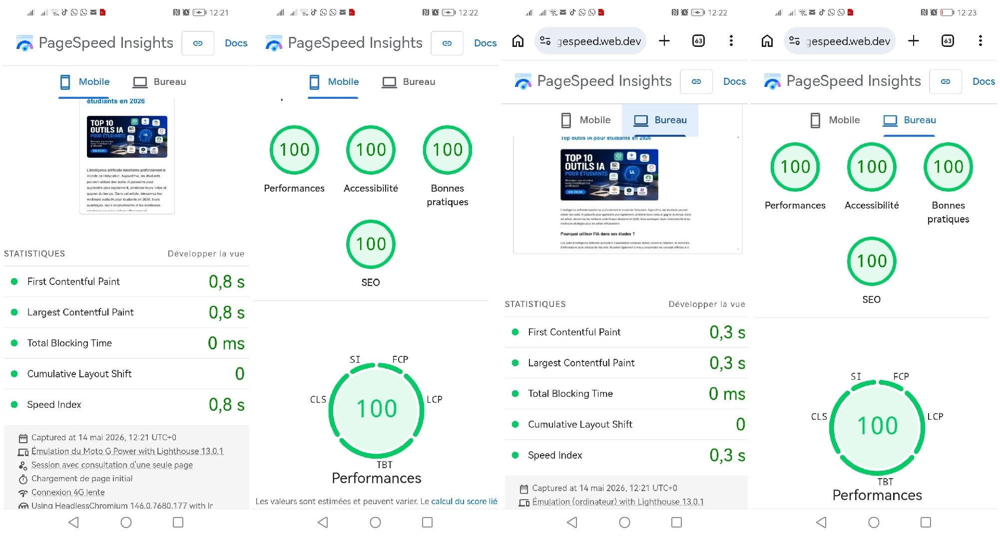

# Technologies et Innovations 🚀

Welcome to the official repository of **Technologies et Innovations**, a platform dedicated to high-performance web auditing, technical SEO, and cybersecurity research.

## 🛠 Services & Expertise
I specialize in optimizing digital projects for maximum performance and visibility:
*   **Web Performance Audits:** Specialized in improving Google PageSpeed Insights and Core Web Vitals.
*   **Performance Proof:** ⚡ 

  
Click here to view my 100% PageSpeed Score

  
  

*   **Technical SEO:** Advanced configuration of robots.txt, sitemaps, and metadata for global visibility.
*   **Monetization Optimization:** Integration of high-performance advertising scripts like The Moneytizer and Adsterra.
*   **Cybersecurity & Bug Bounty:** Focused on vulnerability research and XSS identification.

## 💻 Tech Stack
*   **Web:** HTML5, CSS3, JavaScript (Blogger Theme Optimization).
*   **Environment:** Alpine Linux & Command-line tools.
*   **Hosting:** GitHub Pages.

## 💰 Support My Work
If you find my tools or research helpful, you can support me via cryptocurrency. Your contributions help maintain my security research and web optimization projects.

*   **USDT (TRC20):** [Click here to donate via Crypto](https://komiblaise2025-rgb.github.io/donate.html)
*   **GitHub Sponsors:** Support me directly through my profile.

## 📬 Contact
For professional audits or collaboration inquiries, please reach out via GitHub Issues or my professional social channels linked in my profile.
